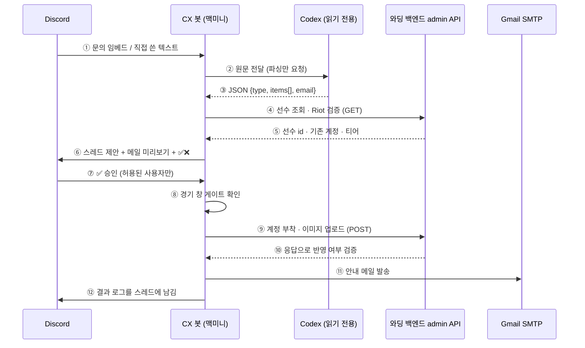

# 와딩 CX 봇: Discord + Codex로 문의 반자동 처리

앱 문의 폼으로 오는 "선수 솔랭 계정 추가·교체" 요청을 백오피스 수작업 대신 Discord 봇이 처리하게 만들었다. 자연어 해석은 Codex에 맡기고, 조회·판정·쓰기는 코드가 하며, 실제 반영은 사람이 ✅ 한 번으로 승인한다.

한 줄 요약: LLM은 "문의 원문 → 구조화 JSON" 한 군데에만 쓰고, 실서비스에 쓰는 모든 단계는 결정적인 코드와 사람 승인 뒤에 둔다.

> 도식 버전: [HTML로 보기](https://changha-dev.github.io/dev-notes/topics/ai-automation/warding-cx-bot.html) ([소스](warding-cx-bot.html))
>
> 토큰, 채널·사용자 ID, 이메일 같은 값은 싣지 않았다.

## 1. 문제와 접근

문의가 오면 백오피스에서 선수 조회, Riot 계정 검증, 기존 계정 확인, 부착, 이미지 확인, 안내 메일까지 사람이 순서대로 처리했다. 순서가 정해진 일이라 템플릿으로 만들 수 있었다. 문의가 올라오는 Discord 채널에 봇을 붙이고, 사람은 제안을 보고 승인만 한다.

## 2. 동작 과정

⑥까지는 어떤 것도 바꾸지 않는다. 실서비스에 쓰는 건 ⑨와 ⑪뿐이고, 그 앞에는 ⑦의 사람 승인과 ⑧의 경기 창 게이트가 있다.

## 3. 판정은 코드가 한다

| 상태 | 조건 | ✅ 이후 |
|---|---|---|
| `created` | 기존 솔랭 계정 0개 | 부착 → 검증 → 메일 |
| `updated` | 기존 1개, 요청과 다름 | 교체 부착 → 검증 → 메일 |
| `already` | 요청 계정이 이미 같음 | 변경 없음, 메일만 |
| `manual` | 기존 2개 이상 | 자동 진행 안 함 |

`manual`로 막는 이유는 부착 API가 계정 목록을 통째로 덮어써서 다른 계정이 사라질 수 있고, 되돌리는 API가 없기 때문이다. 선수를 한 명으로 특정하지 못하거나 Riot 계정이 없을 때, 경기가 진행 중이거나 시작 1시간 전일 때도 쓰기를 막는다.

## 4. 설계 결정

- **Codex는 파싱만 한다.** 읽기 전용 샌드박스에서 도구 없이 돌고, 출력은 JSON 스키마로 강제한다. 모델이 틀려도 코드가 DB에서 다시 확인해서 피해가 쓰기까지 번지지 않는다.
- **자격증명은 봇만 갖는다.** Codex에는 admin 토큰이 가지 않는다. 문의 원문은 "데이터"로 감싸 본문 속 지시문을 따르지 않게 했다.
- **승인은 사람이 한다.** 오부착을 되돌릴 수 없어서 자동 승인 대신 제안, 미리보기, ✅의 3단계로 두었다.
- **기존 자산을 재사용한다.** 새 API 없이 백오피스가 쓰던 검증·부착·이미지 API를 호출하고, 메일은 실제 발송본에서 문구를 뽑아 템플릿으로 만들었다.

## 5. AI를 이렇게 썼다

1. 추측 대신 근거를 모았다. 백오피스 레포의 PR, 백엔드 API, 운영 DB 읽기 조회, 브라우저로 연 실제 발송 메일에서 기존 절차와 문구를 뽑아 설계의 입력으로 삼았다.
2. 계획을 세우고 승인받은 뒤 구현했다. 선택지가 갈리는 곳은 질문으로 합의했다.
3. 비결정적인 일(자연어 → 구조화)만 모델에 맡기고 나머지는 코드로 두었다.
4. 실측으로 검증했다. 자체 테스트, Codex 파싱 실측, SMTP는 발송 없이 로그인만 확인, 드라이런 모드로 전체 흐름 확인 순서로 진행했다.
5. 위험한 단계(운영 계정 권한 부여, 비밀값 저장, 실서비스 스위치)는 권한 분류기가 막았고, 우회하지 않고 사람이 직접 하는 단계로 돌렸다.
6. 실수는 바로 인정하고 고쳤다. 앱 비밀번호를 옮겨 적다 낸 오타는 인증 실패 후 대조해서 찾았다.

## 6. 막힌 곳

| 증상 | 원인 | 조치 |
|---|---|---|
| 봇이 메시지에 반응하지 않음 | 봇 토큰으로 API를 직접 호출해 보니 채널만 `403 Missing Access`였다 | 채널 권한 추가 |
| SMTP `535` | 일반 비밀번호는 거부된다. 앱 비밀번호로 바꾼 뒤에도 옮겨 적다 한 글자를 빠뜨렸다 | 오타 수정, 발송 없이 인증만 재확인 |
| 설정 파일이 명령어 한 줄로 덮임 | 클립보드에 값이 아니라 직전 명령어가 들어 있었다(값 노출 없음) | 비밀값은 클립보드·복사 버튼으로만 옮기는 절차로 변경 |
| 리프레시 토큰이 로테이션되지 않음 | 서버가 같은 토큰을 돌려주는 설계라 노출된 토큰이 계속 유효하다 | 재로그인으로 새 토큰 발급, 옛 토큰 정리 |

## 7. 한계

- DB에 없는 선수 신규 생성, 팀 이동, 계정 2개 이상 선수의 편집은 지원하지 않는다.
- 요청 판정(`type`)이 Codex에 의존해서 드물게 놓칠 수 있다.
- 대기 중인 제안은 메모리에만 있어 봇을 재시작하면 사라진다.
