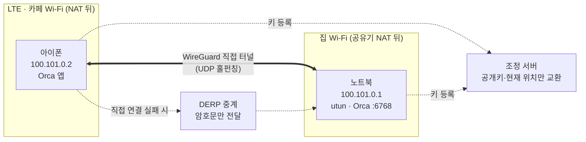
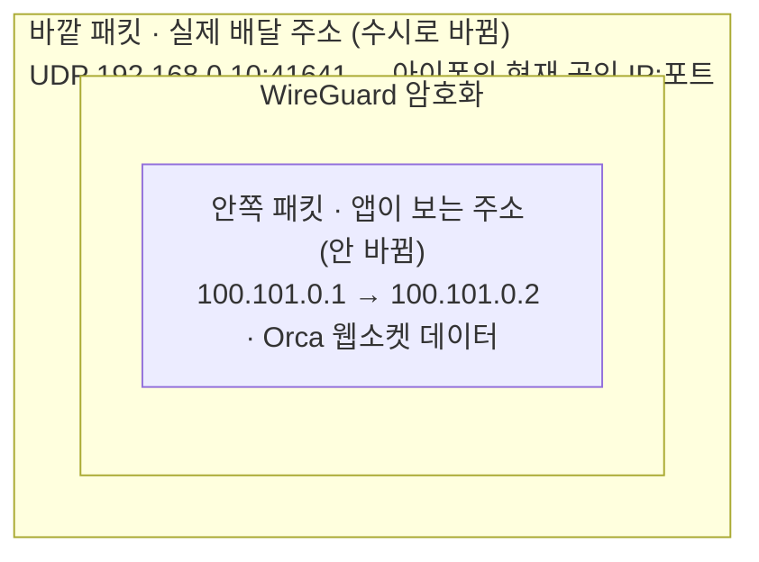
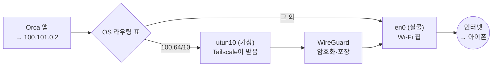
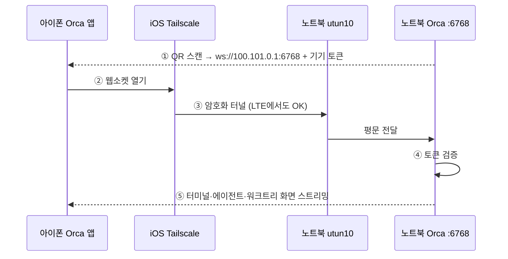
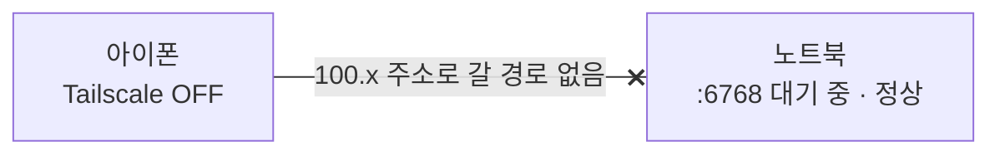

# Tailscale로 밖에서 Orca 쓰기

폰의 Orca Mobile로 집에 있는 노트북의 Orca에 붙어 작업하려고 Tailscale을 쓰다가, 연결이 안 되는 일을 겪으면서 원리를 정리했다.

한 줄 요약: Tailscale은 내 기기끼리만 쓰는 사설망을 인터넷 위에 깐다. Orca는 그 사설망 주소로 폰과 노트북을 잇는다. 작업은 전부 노트북에서 돌고, 폰은 리모컨 역할만 한다.

> 도식 버전: [HTML로 보기](https://htmlpreview.github.io/?https://github.com/Changha-dev/dev-notes/blob/main/topics/networking/tailscale-orca-remote.html) ([소스](tailscale-orca-remote.html))
>
> IP 주소는 예시 값이다. 실제 기기 주소는 공개 레포에 올리지 않는다.

## 1. Tailscale은 어떻게 동작하나

Tailscale은 WireGuard 위에 만든 메시 VPN이다.



1. **기기마다 고정 IP가 붙는다.** 로그인한 기기에 `100.x.x.x` 주소가 생긴다. 집·카페·LTE 어디로 옮겨도 주소는 같다.
2. **조정 서버는 소개만 한다.** "아이폰 공개키는 이거고 지금 이 공인 IP:포트에 있다" 같은 정보만 나눠 준다. 실제 데이터는 이 서버를 거치지 않는다.
3. **NAT를 뚫어 직접 연결한다.** 공유기나 통신사 NAT 뒤에 있어도, 양쪽이 동시에 UDP를 쏘는 방식(홀펀칭)으로 길을 연다. 포트포워딩이 필요 없다.
4. **실패하면 DERP로 우회한다.** 홀펀칭이 막힌 망에서는 Tailscale 중계 서버를 거친다. 처음부터 끝까지 암호화돼 있어 중계 서버는 내용을 볼 수 없다.
5. **앱은 같은 망에 있다고 착각한다.** 앱이 `100.x` 주소로 접속하면 OS가 그 패킷을 터널로 보낸다. 앱은 Tailscale이 있는지 몰라도 된다.

## 2. 어디서든 주소가 같은 이유: 주소가 두 겹이다

`100.x`는 사설 IP처럼 동작한다. 정확히는 `100.64.0.0/10` 대역이다. `192.168.x`·`10.x` 같은 일반 사설 대역(RFC 1918)이 아니라, 통신사 내부망(CGNAT)용으로 따로 떼어 둔 대역(RFC 6598)이다. 공인 인터넷에서는 라우팅되지 않아 겹칠 일이 거의 없고, Tailscale이 이 대역을 빌려 쓴다.



- **안쪽 주소**는 처음 로그인할 때 조정 서버가 기기 키에 묶어 배정하고 서버에 기록한다. Wi-Fi가 바뀌어도 같은 기기 키라 같은 주소를 받는다.
- **바깥 주소**는 진짜 네트워크 주소다. 장소를 옮기면 바뀌지만, 기기가 조정 서버에 "지금 여기 있다"를 계속 알리고, 상대 기기도 마지막으로 패킷이 온 주소로 답한다(WireGuard 로밍).
- 안쪽 주소는 주민번호, 바깥 주소는 현재 거주지다. 이사해도 주민번호는 그대로고, 우편물은 지금 사는 곳으로 간다.
- 중계 서버나 통신사 눈에는 바깥 주소와 암호문만 보인다.

## 3. 랜카드와 가상 랜카드

랜카드(NIC, 네트워크 인터페이스 카드)는 컴퓨터가 네트워크와 데이터를 주고받는 출입구다. 옛날 PC는 메인보드에 꽂는 카드 부품에 랜선을 꽂아서 이 이름이 붙었다. 지금 맥북에서는 Wi-Fi 칩이 이 역할을 한다.

OS 입장에서 랜카드는 이름과 IP가 붙은 출입구 하나다. `ifconfig`를 치면 목록이 나온다.

| 이름 | 정체 | IP |
|---|---|---|
| `en0` | 실물 Wi-Fi 칩 | `192.168.0.10` (공유기가 배정) |
| `lo0` | 가상. 자기 자신에게 보내는 출입구 | `127.0.0.1` (localhost) |
| `utun10` | 가상. Tailscale이 만든 것 | `100.101.0.1` |

가상 랜카드는 하드웨어 없이 소프트웨어로 만든 출입구(TUN 인터페이스)다. 앱과 OS 눈에는 진짜와 똑같다. 차이는 출구 쪽이다. `en0`으로 나간 패킷은 Wi-Fi 칩이 전파로 쏘고, `utun10`으로 나간 패킷은 Tailscale 프로그램이 받아 암호화한 뒤 다시 `en0`으로 내보낸다. VPN은 전부 이 방식이다.



macOS에서 직접 확인할 수 있다.

```console
$ netstat -rn -f inet | grep utun10
100.64/10          link#35   UCS   utun10     # 100.64.0.0/10 대역은 전부 utun10으로
100.101.0.1        ...       UH    utun10     # 내 Tailscale 주소

$ route -n get 100.101.0.2                    # 아이폰 주소
  interface: utun10
```

## 4. Orca는 이 위에서 어떻게 붙나

Orca 설정의 휴대폰 페어링에서 연결 방식을 "LAN"으로 두고, "이 컴퓨터의 주소"에서 `utun10`을 고르면 Tailscale 주소가 QR에 들어간다.



- 데스크탑 Orca는 `6768` 포트를 모든 인터페이스에 열어 둔다(`lsof -nP -iTCP:6768 -sTCP:LISTEN`으로 `*:6768` 확인).
- Claude 실행, git, 빌드는 전부 노트북에서 돈다. 폰은 화면과 입력만 담당한다.

### LAN + Tailscale vs Orca Relay

| | LAN + Tailscale | Orca Relay |
|---|---|---|
| 경로 | 내 기기끼리 직접 연결 (P2P) | Orca 서버가 중계 |
| 필요한 것 | 폰·노트북 모두 Tailscale | Orca 로그인 |
| 장점 | 외부 서버를 거치지 않음, 지연이 대체로 짧음 | 폰에 VPN 불필요 |
| 단점 | 폰 VPN이 꺼지면 연결 불가 | Orca 서버 경유, 아직 베타 |

## 5. 겪은 문제: QR 스캔 후 25초 대기하다 에러

오랜만에 Orca Mobile에 들어가니 연결이 끊겨 있었고, QR을 다시 스캔해도 25초 기다린 뒤 에러가 났다.



- 노트북은 정상이었다. Orca가 `*:6768`에서 대기 중이었고 Tailscale 주소도 살아 있었다.
- `tailscale status`에서 아이폰이 `offline, last seen 9d ago`였다. 폰이 터널 밖에 있으니 `100.x`로 가는 패킷이 갈 곳이 없었다.
- 해결: 폰에서 Tailscale 앱을 열어 VPN을 켜고 QR을 다시 스캔한다. 같은 Wi-Fi라면 주소를 `en0`으로 바꿔도 된다.

## 밖에서 쓰려면

- **노트북이 깨어 있어야 한다.** 덮개를 닫거나 잠자기에 들면 끊긴다. `caffeinate -s`나 잠자기 방지 앱을 쓰거나, 늘 켜 둔 맥미니를 호스트로 쓴다.
- **폰 Tailscale이 켜져 있어야 한다.** 오래 안 쓰면 iOS가 VPN을 끊거나 로그인이 만료된다.
- **주문형 VPN(VPN On Demand)을 켠다.** 끊겨도 자동으로 다시 붙는다.
